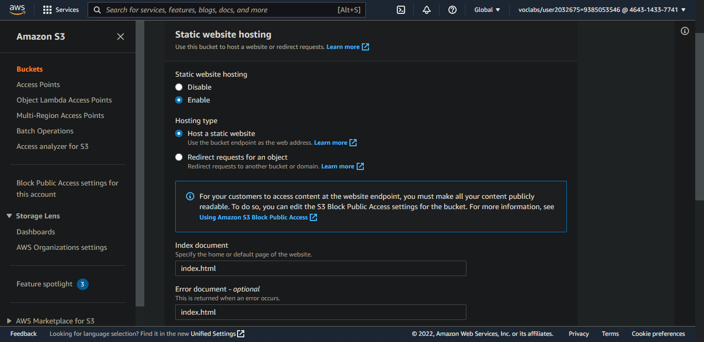

# Static Website on AWS

A static website hosted through a public AWS S3 bucket, and distributed using AWS's CloudFront.

## Website Access Points
### 🔗 <a href="https://d2blkfjd6lqtlz.cloudfront.net/">CloudFront</a>
### 🔗 <a href="http://my-464314337741-bucket.s3-website.us-east-1.amazonaws.com/">Website Endpoint</a>
### 🔗 <a href="https://my-464314337741-bucket.s3.amazonaws.com/index.html">Bucket-object URL</a>

## Preview Screenshots

### 1. Website files in public S3 Bucket

### 2. Configure bucket for static web hosting

### 3. Bucket configured as static web host endpoint

### 4. IAM policy to make bucket contents publicly accessible

### 5. CloudFront configured and deployed

### 6. Customized web running
